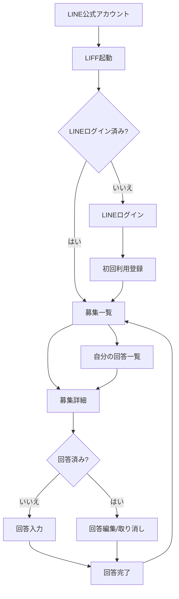
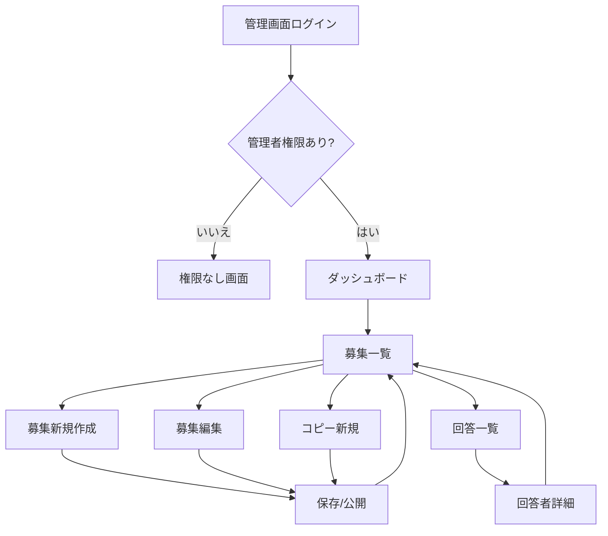
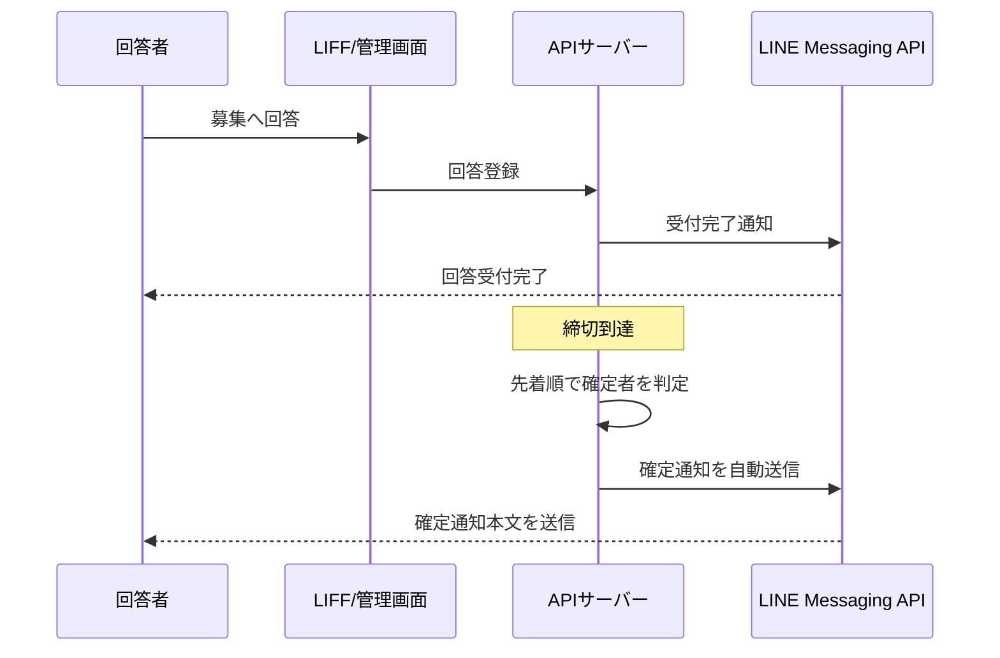

# PTA活動募集サイト 画面遷移図

## 1. 前提

- 回答者はLINE公式アカウントからLIFFを起動する
- 回答単位は個人
- 募集は先着順で、定員到達時に新規回答を停止する
- 回答は締切まで編集、取り消し可能
- 取り消しが出た場合は現在人数のみ減少し、定員未達なら回答ボタンを再活性化する
- 確定通知は締切後に自動送信する
- 確定通知本文はアンケート作成時に管理画面で入力必須とする

## 2. 回答者向け画面遷移

## 3. 回答者向け画面定義

### 3-1. LIFF起動
- 役割: LINE内からアプリを起動する入口
- 主な処理: LIFF初期化、LINEログイン状態確認、ユーザー識別
- 遷移先:
  - ログイン未了なら「LINEログイン」
  - ログイン済みなら「募集一覧」

### 3-2. LINEログイン
- 役割: LINEアカウントで本人識別する
- 主な処理: `line_user_id` の取得、初回ユーザー登録判定
- 遷移先:
  - 初回なら「初回利用登録」
  - 既存なら「募集一覧」

### 3-3. 初回利用登録
- 役割: 回答者レコード作成
- 主な処理: LINE表示名など最低限のプロフィール保存
- 遷移先:
  - 「募集一覧」

### 3-4. 募集一覧
- 役割: 公開中募集を一覧表示
- 表示内容:
  - タイトル
  - 開催日時
  - 募集人数
  - 現在回答人数
  - 回答状態
  - 募集締切
- 主な操作:
  - 募集詳細へ進む
  - 自分の回答一覧へ進む
- 制御:
  - 定員到達時は回答ボタンを非活性
  - 取り消しで定員未達に戻った場合は回答ボタンを再活性

### 3-5. 募集詳細
- 役割: 募集内容の詳細表示
- 表示内容:
  - 募集内容
  - お仕事内容
  - スタッフ/運営区分
  - 開催日
  - 開催時間
  - 募集人数
  - 現在回答人数
  - 締切日時
- 主な操作:
  - 未回答なら回答入力
  - 回答済みなら回答編集
  - 回答済みなら回答取り消し

### 3-6. 回答入力
- 役割: 参加回答の登録
- 主な操作:
  - 必要項目入力
  - 送信
- 主な処理:
  - 定員超過チェック
  - 回答レコード作成
  - 回答受付完了通知の送信
- 遷移先:
  - 「回答完了」

### 3-7. 回答編集/取り消し
- 役割: 締切前の回答変更
- 主な操作:
  - 回答内容更新
  - 回答取り消し
- 主な処理:
  - 回答更新または回答削除
  - 人数再計算
  - 定員未達になった場合は募集を再び回答可能状態へ戻す
- 遷移先:
  - 「回答完了」

### 3-8. 回答完了
- 役割: 更新完了の確認
- 表示内容:
  - 回答受付完了、または取り消し完了メッセージ
  - 以後の通知案内
- 遷移先:
  - 「募集一覧」

### 3-9. 自分の回答一覧
- 役割: 自分が回答済みの募集を一覧表示
- 表示内容:
  - 募集名
  - 開催日時
  - 自分の回答日時
  - 確定前/確定済み
- 遷移先:
  - 「募集詳細」

## 4. 管理者向け画面遷移

## 5. 管理者向け画面定義

### 5-1. 管理画面ログイン
- 役割: 管理画面入口
- 主な処理: LINEログイン情報またはアプリ管理者照合
- 遷移先:
  - 権限ありなら「ダッシュボード」
  - 権限なしなら「権限なし画面」

### 5-2. 権限なし画面
- 役割: 管理者未登録時の案内表示
- 表示内容:
  - 利用不可メッセージ
  - 問い合わせ先

### 5-3. ダッシュボード
- 役割: 管理者向けサマリー表示
- 表示内容:
  - 公開中募集数
  - 締切間近募集
  - 定員到達済み募集
  - 未送信の締切後確定通知対象数
- 主な操作:
  - 募集一覧へ進む

### 5-4. 募集一覧
- 役割: 募集の検索、管理
- 表示内容:
  - タイトル
  - 公開状態
  - 開催日時
  - 締切日時
  - 募集人数
  - 現在回答人数
- 主な操作:
  - 新規作成
  - 編集
  - コピー新規
  - 回答一覧確認

### 5-5. 募集新規作成
- 役割: 新しい募集の作成
- 入力項目:
  - タイトル
  - 募集内容
  - お仕事内容
  - スタッフ/運営区分
  - 開催日
  - 開催開始時間
  - 開催終了時間
  - 募集人数
  - 公開開始日時
  - 締切日時
  - 確定通知本文
- 制御:
  - 確定通知本文は必須
  - 下書き保存と公開を選べる

### 5-6. 募集編集
- 役割: 既存募集の更新
- 主な操作:
  - 募集条件更新
  - 公開/非公開切替
  - 締切日時変更
  - 確定通知本文更新

### 5-7. コピー新規
- 役割: 既存募集を複製して新規作成
- 主な処理:
  - 元募集内容を初期値として読み込み
  - 日時、人数、公開期間を変更して保存

### 5-8. 回答一覧
- 役割: 回答状況の確認
- 表示内容:
  - 回答者名
  - 回答日時
  - 確定対象かどうか
  - 取り消し済みかどうかは一覧に残さず、現存回答のみ表示
- 主な操作:
  - 回答者詳細確認
  - 現在人数確認

### 5-9. 回答者詳細
- 役割: 個別回答内容の確認
- 表示内容:
  - LINE表示名
  - 回答内容
  - 回答日時
  - 通知送信履歴

## 6. 通知タイミング

## 7. 画面設計上の補足

- 回答者画面では他者の氏名を出さず、人数のみ表示する
- 回答ボタンの活性/非活性は `現在回答人数 < 募集人数` と締切前判定の両方で制御する
- 締切後の確定通知はバッチ実行でもよいが、MVPでは締切直後から10分後程度の非同期実行で十分
- 回答取り消しは専用状態を持たず、回答削除として扱う
- 管理画面では確定通知本文を募集単位で保持する

## 8. 次に作るもの

この次は以下の順が自然。

1. DBテーブル詳細設計
2. API一覧
3. `Next.js` での画面ひな型作成
